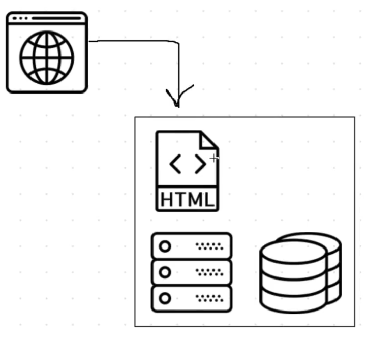
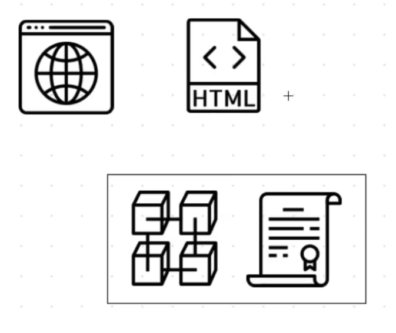

<h1 align="center">Ethereal</h1>

### **Taking Banking System to the next level with Solidity Smart Contracts.**
This application is supported with a backend built using Solidity Smart Contracts and the frontend is built using React JS, the backend is deployed to the local Ethereum network Ganache. The whole project runs on an Ethereum supported browser, with the help of the Metamask extension. 

 

#### **For your understanding and ease of working on this project we have divided this project into several easy-to-work modules. These are the various modules in the project :**  

This project was built using React frontend but we will try our best to keep it Language friendly so that you can understand the logic and build it even using normal HTML+CSS+JS.

<!-- Also need to talk about Remix ,Ganache CLI and UI difference if possible and Solidity test. -->

 

#### **1.Getting started :**
In these modules, you learn about Blockchain and Ethereum, Solidity Language Fundamentals, Metamask, Ganache, Truffle, and Web3. Completing the initial setup for your project and installing all the dependencies and getting started with your project.

#### **2.Start writing your first smart contract:**
In this module, you explore the folder structure of the whole project. You define basic variables in your smart contract and explore the syntax of Solidity. You deploy and migrate this basic smart to the local blockchain and test if it is working.

#### **3.Starting with the first Functionality feature =>Creating a new account:**
In this module, you add code to your Solidity Smart Contract to create a new account and display it on your Banking Website.

#### **4.Adding new features =>Displaying Accounts,Account Details and Adding Balance :**
In this module, you add code to your Solidity Smart Contract to add balance to your virtual account created on your Banking Website Ethereal. This function allows you to perform very basic banking transactions.

#### **5.Introducing the new feature=>Withdrawing Balance and Transfer Amount to other virtual accounts on the Bank**:
In this module, you add code to your Solidity Smart Contract to withdraw ether and transfer the amount from one virtual account to another.

#### **6.Introducing the last feature=>Adding the Loans feature to our virtual Bank and Wrapping up :**
###### **Now this feature has limitations and is not perfect but the deed is correctly performed **
In this module, you add code to your Solidity Smart Contract to implement the Loans Feature. This function allows you to take some balance from the bank and it cuts the same amount of balance from your bank account in certain intervals.

#### **7.Last Module : *(additional)***
In this module, you can further complicate your project and as the various Accounts were created and displayed, you can even log every transaction made by every account on the Blockchain network and you can log the particular Transactions for that particular Account. You can also design the project as per your choosing, some basic templates will be provided to you in the Resources.

##### So, shall we begin ?

 

----

## **Module 1: Getting Started** :

So there were a lot of complicated terms used in this project but we need to understand each and every one of them to get a clear picture of the project. This will help you to build a very strong base and will get a clearer picture of the project.

 

### **What is Blockchain?**

Blockchain technology is a type of distributed ledger technology (DLT) — It is an accounting system where the **ledger** (record of transactions) is **distributed** among a network of computers.

**So at its core, blockchain technology is a record-keeping tool.**

If you are slightly familiar with development , you would know that a database is a place where you store all the data pertaining to an application , hence we are using Blockchain technology as a database in our application.

One key difference between a typical database and a blockchain is the way the data is structured. A blockchain collects information together in groups, also known as blocks, that hold sets of information. Blocks have certain storage capacities and, when filled, are chained onto the previously filled block, forming a chain of data known as the “blockchain.” All new information that follows that freshly added block is compiled into a newly formed block that will then also be added to the chain once filled.

Beginners guide for [Blockchain](https://medium.com/@sinafl/blockchain-101-a-beginners-guide-410d4d93d635).

### **How Does a Blockchain Application Work ?**
In order to understand how a blockchain application works, let's first look at how a normal web application might work :

To access a normal web application, you would use a web browser that would communicate with a web server over the Internet. The server contains all of the code and data for the application.

 

*Here is a list of what you would find on the server :*
- Client-side files in HTML, CSS, and JavaScript
- Back end code responsible for the application's business logic
- Database that stores all the information of the application

This server is a centralized entity that has full control over every aspect of the application. Anyone with full access to the server can change any part of the code or the data at any time. A blockchain application works quite differently. All of the code and the data of a web application do not lie on a centralized server. Instead, it is distributed across the blockchain. All of the code and the data is shared and unchangeable on the blockchain.

To illustrate this, let's examine how our blockchain-based web application will work.

 

To access the blockchain application, we'll use a web browser to talk to the client-side application, which will be written in HTML, CSS, and JavaScript. Instead of talking to a back-end web server, the client-side application will talk directly to the blockchain.

#### *KEY TAKEAWAYS :*

- Blockchain is a specific type of database.
- It differs from a typical database in the way it stores information; blockchains store data in blocks that are then chained together. 
- As new data comes in it is entered into a fresh block. Once the block is filled with data it is chained onto the previous block, which makes the data chained together in chronological order.
- Different types of information can be stored on a blockchain but the most common use so far has been as a ledger for transactions. 
- In Bitcoin’s case, blockchain is used in a decentralized way so that no single person or group has control—rather, all users collectively retain control.
- Decentralized blockchains are immutable, which means that the data entered is irreversible. For Bitcoin, this means that transactions are permanently recorded and viewable to anyone.

For in-depth detail click [here](https://www.investopedia.com/terms/b/blockchain.asp#what-is-blockchain).

#### **Ethereum DAPP Architecture**

A blockchain DApp has its own backend code called **smart contracts** that can be deployed to a blockchain (most commonly Ethereum). A smart contract defines the logic of the entire DApp. It is the lifeblood of using a blockchain as a backend.

Dapps Development includes three simple steps

1. Deploying a smart contract on the blockchain network
2. Reading data from the deployed smart contract
3. Sending transactions to the deployed smart contract

*The interface we generally use for communicating with our smart contracts in a blockchain network is web3.js or web3.py.*

web3.js is a collection of libraries that allow you to interact with a local or remote ethereum node using HTTP, IPC or WebSocket.
For in-depth detail click [here](https://web3js.readthedocs.io/en/v1.5.2/).

<h4 align="center"> Ethereum Dapp Structure </h4>

 

### **What is a Smart Contract ?**

All of the code on the blockchain is contained in smart contracts, which are programs that run on the blockchain. They are the building blocks of blockchain applications. We'll write a smart contract in this project to power our Banking system. It will be responsible for fetching all of the operations in our Banking System from the blockchain.

There are a lot of options out there to write smart contracts like solidity, vyper, LLL,serpent but for this project we will use solidity, which looks a lot like JavaScript/C++. All of the code in the smart contract is immutable, or unchangeable. Once we deploy the smart contract to the blockchain, we won't be able to change or update any of the code. This is a design feature that ensures that the code is trustless and secure. They act as an interface for reading and writing data from the blockchain, as well as executing business logic. They're publicly accessible, meaning anyone with access to the blockchain can access their interface.

For in-depth detail click [here](https://www.investopedia.com/terms/s/smart-contracts.asp).

### **Intro To Solidity :**
Solidity is the main programming language for writing smart contracts for the Ethereum blockchain. It is a contract-oriented language, which means that smart contracts are responsible for storing all of the programming logic that transacts with the blockchain. It's a high-level programming language that looks a lot like JavaScript, Python, and C++. It's designed to run on the Ethereum Virtual Machine (EVM), which is hosted on Ethereum Nodes that are connected to the blockchain. It is statically typed, and supports inheritance, libraries, and more! In short, it has all the capabilities that you need in order to build industrial-strength blockchain applications.

**basic structure of a solidity contract :**

`pragma solidty ^0.5.0                                //tells the compiler which version of the compiler to use `

contract contract_name{

uint variable_name1,variable_name2,... ;                                                                                                         

/// put the code structure here with comments to explain their use

}

For in-depth detail click [here](https://docs.soliditylang.org/en/v0.8.9/).